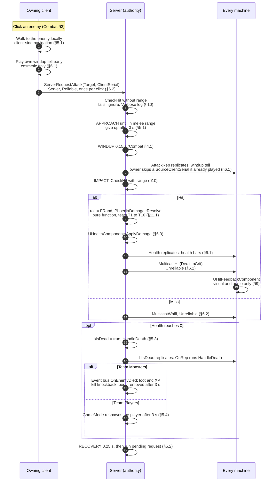
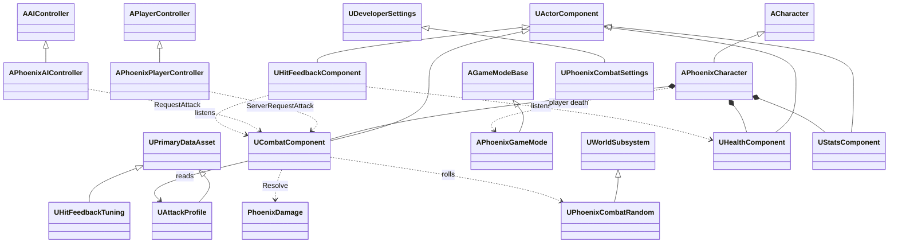
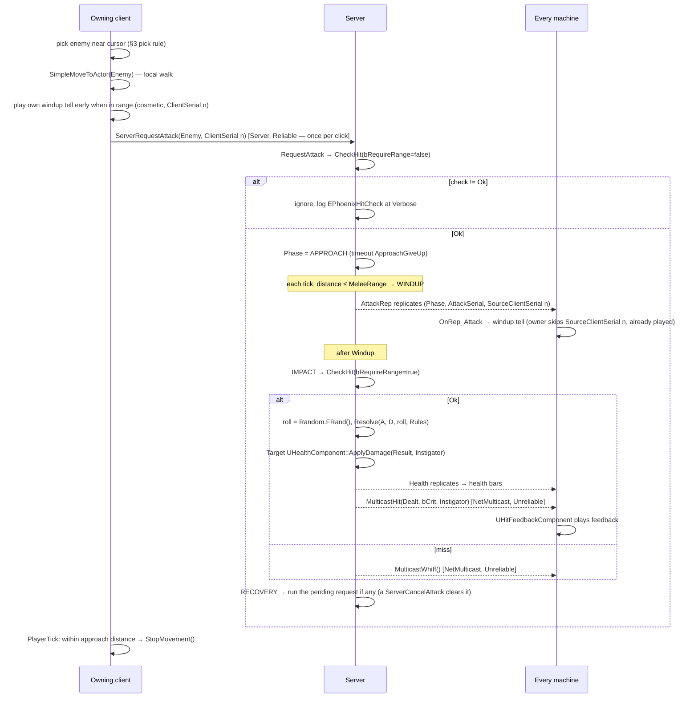
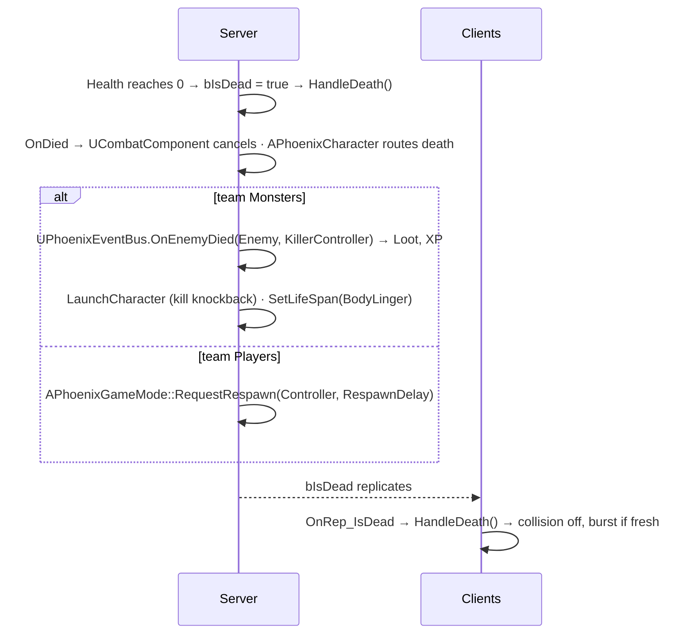

# Combat — Technical Design

> [!warning] **Superseded 2026-09-25 — written for Unreal Engine.** Phoenix moved to Rust + Bevy ([[Decisions]] ADR-008). Kept as history; the reasoning may still be useful, the mechanisms are not. Engine-independent design lives in [[Design-Doc]] and [[Combat]].


> [!info] **What this is.** How [[Combat]] is built: classes, data, runtime flow, what runs where, tests. Built on
> [[OOP-Foundations]]; its class-design checklist is filled in for every class in §2.2.
> **Planning only. Code blocks are illustrative and uncompiled. No game code is written until "go build".**

> [!important] **Requirement held to.** Friends can join and play in v1 ([[Decisions]] ADR-007), so every mechanism
> must be correct in **Standalone**, **Listen Server** and **Client**, and passing in all three is a **v1 release gate**.

Engine citations are to `/Users/Shared/Epic Games/UE_5.8/Engine/Source/`, UE 5.8.2, all opened on 2026-09-15.

## Revision history

| rev | date | what changed |
|---|---|---|
| r1 | 2026-09-15 | First draft — pilot of the technical-spec template. |
| r2.2 | 2026-09-15 | Sequence diagrams in §1 and §5.1 brought in line with r2.1 (`ClientSerial`, `SourceClientSerial`, cancel clears pending) — they had been missed. |
| r2.1 | 2026-09-15 | Aligned with [[Network-Protocol]] r2: `ClientSerial`, cancel during recovery, `Team` and `MaxHealth` notify replicated, killer server-only, engine cap on `MulticastHit`. |
| **r2** | **2026-09-15** | After a design review and a claim-verification review (127 claims checked, 24 false). Every finding re-checked against engine source before being applied. Three r1 mechanisms did not work for a client; see **§16** for every change. |

## Name status

| mark | meaning |
|---|---|
| **existing** | Named in [[Architecture]] or [[Step-1-Move-and-Attack]] — reused as-is |
| **existing, narrowed** | Existing name, responsibility changed — **needs approval** |
| **proposed** | New name — **needs approval** (full list in §15) |

---

## 1. Summary

> [!note] **Canonical diagram: this one.** A copy lives on the [Phoenix Miro board](https://miro.com/app/board/uXjVHndMfFs=/?moveToWidget=3458764683734693359)
> for easier reading; if the two ever differ, this note wins. Section numbers (§) refer to this note; "Combat §" refers to [[Combat]].



## 2. Classes

### 2.1 Responsibilities (CRC)

| class | mark | inherits | responsibilities | collaborators |
|---|---|---|---|---|
| `APhoenixPlayerController` | existing | `APlayerController` | Reads clicks · picks the enemy near the cursor · walks its pawn locally · sends attack requests · stops walking once in range · plays its own windup early | `UCombatComponent` |
| `APhoenixCharacter` | existing | `ACharacter` | Hosts gameplay components · holds its team · routes its own death (monster → event bus; player → game mode) · rejects non-Phoenix damage loudly | its components, `UPhoenixEventBus`, `APhoenixGameMode` |
| `APhoenixAIController` | existing | `AAIController` | Decides when enemies attack (Enemies & AI spec) · requests attacks through the same entry point | `UCombatComponent` |
| `UCombatComponent` | **proposed** | `UActorComponent` | Accepts attack requests from player and AI alike · validates them · runs approach, windup and recovery · keeps at most one pending request · resolves impact | `UHealthComponent`s, `PhoenixDamage`, `UAttackProfile`, `UPhoenixCombatRandom` |
| `UHealthComponent` | existing | `UActorComponent` | Holds health · applies resolved damage on the server · handles death once per life on every machine · announces damage, health change and death | — |
| `UStatsComponent` | existing | `UActorComponent` | Supplies damage, crit, armour, resistances, attack speed (from M2) | — |
| `PhoenixDamage` | **proposed** | namespace | Computes a hit's damage from plain numbers — **no UObjects, no world, no randomness of its own** | — |
| `UPhoenixCombatSettings` | **proposed** | `UDeveloperSettings` | Holds game-wide damage rules and game rules (body linger, respawn delay, cursor pick radius) | — |
| `UAttackProfile` | **proposed** | `UPrimaryDataAsset` | Holds one character type's attack timings, range and base crit | — |
| `UHitFeedbackTuning` | **proposed** | `UPrimaryDataAsset` | Holds each feedback technique's on/off and strength | — |
| `UHitFeedbackComponent` | **proposed** | `UActorComponent` | Plays visual and audio feedback only · never runs on a dedicated server · never changes simulation | `UHealthComponent`, `UCombatComponent` (listens) |
| `UPhoenixCombatRandom` | **proposed** | `UWorldSubsystem` | Owns the server's random stream for combat rolls | — |
| `UPhoenixEventBus` | **existing, narrowed** | `UGameInstanceSubsystem` | Carries **server-side** gameplay events only ([[OOP-Foundations#7.4 Finding: the Architecture event bus does not cross machines\|OOP-Foundations §7.4]]) | Loot, Progression |
| `APhoenixGameMode` | existing | `AGameModeBase` | Respawns a dead player after the delay (server only) | `APhoenixPlayerController` |

**Deferred:** `UHitboxComponent` (existing). r1 narrowed it to "does this attack reach that target?" — but that check
has no data of its own, so it is `UCombatComponent::CheckHit` in v1. It returns in the Skills spec, where shaped area
queries give it real state. No change to [[Architecture]] is needed until then.

### 2.2 Class-design checklist, filled in

[[OOP-Foundations#8. The class-design checklist|OOP-Foundations §8]], one row per class.

| class | role (§2.2) | created by (§4.2) | references (§4.1) | layer (§5) | authority (§7.2) |
|---|---|---|---|---|---|
| `APhoenixPlayerController` | engine role: player controller | engine, per player | pawn via engine | gameplay | owning client + server |
| `APhoenixCharacter` | engine role: character | spawn / placement | components `UPROPERTY` | gameplay | server-authoritative, replicated |
| `APhoenixAIController` | engine role: AI controller | engine, for AI pawns | pawn via engine | gameplay | **server only** — `Controller.cpp:67` `bOnlyRelevantToOwner = true` |
| `UCombatComponent` | component | `CreateDefaultSubobject` in character constructor | target `TWeakObjectPtr`; profile `UPROPERTY` | components | server logic; `SetIsReplicatedByDefault(true)` in constructor (`ActorComponent.h:1471`) |
| `UHealthComponent` | component | `CreateDefaultSubobject` in character constructor | killer `TWeakObjectPtr<AController>` | components | server applies; `SetIsReplicatedByDefault(true)` |
| `UStatsComponent` | component | `CreateDefaultSubobject` | — | components | server; replication decided in Stats spec |
| `PhoenixDamage` | none — functions | — | none | data & rules | pure, runs anywhere |
| `UPhoenixCombatSettings` | settings object | engine, from config | — | data & rules | read-only |
| `UAttackProfile` / `UHitFeedbackTuning` | data asset | authored in editor | referenced `UPROPERTY(EditDefaultsOnly)` | data & rules | read-only |
| `UHitFeedbackComponent` | component | **added in `BP_PhoenixCharacter` / `BP_Enemy`, not C++** — so gameplay code never includes it | tuning `UPROPERTY` | feedback & UI | local only; returns early on `NM_DedicatedServer` |
| `UPhoenixCombatRandom` | world subsystem | engine, per world | — | components | server only |
| `UPhoenixEventBus` | game instance subsystem | engine, per game instance | — | gameplay | server-side events only |
| `APhoenixGameMode` | engine role: game mode | engine | — | gameplay | **server only** — `GameModeBase.h:35` |

## 3. Class diagram



> [!note] Readable copy on the [Phoenix Miro board](https://miro.com/app/board/uXjVHndMfFs=/?moveToWidget=3458764683755344920); **this note is canonical.**

`*--` = created in the character's C++ constructor. `UHitFeedbackComponent` has **no** `*--` edge from the C++
character on purpose — it is added in the Blueprint, so the gameplay layer never depends on the feedback layer.

## 4. Data

```cpp
// illustrative — uncompiled
UENUM() enum class EPhoenixDamageType : uint8 { Physical, Fire, Cold, Lightning, Num };
UENUM() enum class EPhoenixTeam : uint8 { Players, Monsters };
UENUM() enum class EPhoenixAttackPhase : uint8 { Idle, Approach, Windup, Recovery };
UENUM() enum class EPhoenixHitCheck : uint8 { Ok, NoTarget, AttackerDead, TargetDead, SameTeam, OutOfRange };

USTRUCT() struct FPhoenixDamageRules              // plain data: PhoenixDamage depends on this, never on a UObject
{
    GENERATED_BODY()
    UPROPERTY(EditAnywhere) float ArmourK   = 5.f;
    UPROPERTY(EditAnywhere) float ArmourCap = 0.90f;
    UPROPERTY(EditAnywhere) float ResistCap = 0.75f;
};

USTRUCT() struct FPhoenixAttackerNumbers
{
    GENERATED_BODY()
    float Damage[(int)EPhoenixDamageType::Num];       // sized by the enum: no out-of-range index
    float CritChance;                                 // 0..1
    float CritMultiplier;                             // e.g. 1.5
};

USTRUCT() struct FPhoenixDefenderNumbers
{
    GENERATED_BODY()
    float Armour;
    float Resistance[(int)EPhoenixDamageType::Num];   // Physical slot unused
};

USTRUCT() struct FPhoenixDamageResult { GENERATED_BODY() int32 Dealt = 0; bool bCrit = false; };

namespace PhoenixDamage
{
    // CritRoll is a number in [0,1) supplied by the caller. Tests pass exact rolls; the server passes a roll from
    // UPhoenixCombatRandom. The function itself has no randomness, no UObject and no world.
    FPhoenixDamageResult Resolve(const FPhoenixAttackerNumbers& A, const FPhoenixDefenderNumbers& D,
                                 float CritRoll, const FPhoenixDamageRules& Rules);
}

USTRUCT() struct FPhoenixHitCosmetic              // sent as an event, not stored state
{
    GENERATED_BODY()
    UPROPERTY() int32 Dealt = 0;                  // resolved damage — overkill shows 500, not the health lost
    UPROPERTY() bool bCrit = false;
    UPROPERTY() TObjectPtr<AActor> Instigator;
};

USTRUCT() struct FPhoenixAttackRep                // the one replicated fact about an attack
{
    GENERATED_BODY()
    UPROPERTY() EPhoenixAttackPhase Phase = EPhoenixAttackPhase::Idle;
    UPROPERTY() uint8 AttackSerial = 0;           // increments per windup on the server
    UPROPERTY() uint8 SourceClientSerial = 0;     // the ClientSerial of the request that started it; 0 if server-driven
};
```

## 5. Runtime flow

### 5.1 Player clicks an enemy

**Why the client walks itself.** A client cannot pathfind by default, and a server cannot drive a remote client's
character by path-following:

- `SimpleMoveToActor` / `SimpleMoveToLocation` (`AIModule/Classes/Blueprint/AIBlueprintHelperLibrary.h:92,95`) return
  early with a warning when there is no navigation system (`AIModule/Private/Blueprint/AIBlueprintHelperLibrary.cpp:529-534`).
- A client gets no navigation system unless `bAllowClientSideNavigation` is set: `NavigationSystem.cpp`,
  `if (bCreateOnClient == false && World.GetNetMode() == NM_Client)` → no system. The setting is
  `UPROPERTY(config)` on `UNavigationSystemV1` (`NavigationSystem/Public/NavigationSystem.h:329-331`, class `config=Engine` at `:290`).
- On the server, a remote client's character only runs a controlled move when it is locally controlled
  (`CharacterMovementComponent.cpp:1751-1757`), which a remote client's character is not.

So [design]: **client-side navigation on; the owning client walks its own pawn** (movement already replicates with
correction); **the server decides combat**, and checks range again at impact, so a client lying about position gains
nothing.

```ini
; Config/DefaultEngine.ini
[/Script/NavigationSystem.NavigationSystemV1]
bAllowClientSideNavigation=True
```



> [!note] Readable copy on the [Phoenix Miro board](https://miro.com/app/board/uXjVHndMfFs=/?moveToWidget=3458764683755344924); **this note is canonical.**

**In Standalone** the client and server are one game instance and `NM_Standalone` is *"Still considered a server
because it has all server functionality"* (`Engine/Classes/Engine/EngineBaseTypes.h:980`). The RPC runs locally.

### 5.2 Hold to attack, and cancelling

```cpp
UFUNCTION(Server, Reliable) void ServerRequestAttack(AActor* Target, uint8 ClientSerial);   // click / press
UFUNCTION(Server, Reliable) void ServerSetHoldAttack(bool bHeld);       // press and release only — never per frame
UFUNCTION(Server, Reliable) void ServerCancelAttack();                  // any ground click while an attack is active or pending, recovery included
```

After recovery, if held and the target is alive, the server re-enters approach or windup itself. No per-frame RPC.

**Why this matters:** reliability is fixed per function at compile time, so r1's "reliable for a click, unreliable while
holding" on one function was impossible. And reliable messages have a limited queue: `RELIABLE_BUFFER = 512`
(`Engine/Classes/Engine/NetConnection.h:82`); on overflow the channel logs *"Too many reliable messages queued up"* and
closes with `MaxReliableExceeded` (`Engine/Private/DataChannel.cpp:681-688`; outgoing `:1414`, `:1439` *"we can't
recover from this"*). A reliable RPC sent every frame while holding would eventually disconnect the player.

### 5.3 Death — one function, two callers

RepNotify functions run only on machines that **receive** replicated data (`FRepLayout::CallRepNotifies(FReceivingRepState*, …)`,
`Engine/Private/RepLayout.cpp:4661`). They never run on the server, or in Standalone. So death handling cannot live
only in `OnRep_IsDead`.

```cpp
// illustrative
void UHealthComponent::ApplyDamage(const FPhoenixDamageResult& R, AController* Instigator)   // server
{
    if (bIsDead) return;
    Health = FMath::Max(0.f, Health - R.Dealt);
    MulticastHit({ R.Dealt, R.bCrit, Instigator ? Instigator->GetPawn() : nullptr });
    if (Health <= 0.f)
    {
        bIsDead = true;
        LastKiller = Instigator;
        DeathServerTime = GetWorld()->GetGameState()->GetServerWorldTimeSeconds();   // GameStateBase.h:72
        HandleDeath();                                         // server path
    }
}
void UHealthComponent::OnRep_IsDead() { HandleDeath(); }       // client path

void UHealthComponent::HandleDeath()                           // every machine, once per life
{
    if (bDeathHandled || !bIsDead) return;
    bDeathHandled = true;
    GetOwner()->SetActorEnableCollision(false);                // Actor.h:1926 — on server AND clients
    const double Age = GetWorld()->GetGameState()->GetServerWorldTimeSeconds() - DeathServerTime;
    OnDied.Broadcast(LastKiller.Get(), /*bFresh*/ Age < 0.5);  // feedback skips the burst for an old death
}
```



> [!note] Readable copy on the [Phoenix Miro board](https://miro.com/app/board/uXjVHndMfFs=/?moveToWidget=3458764683755344923); **this note is canonical.**

`SetLifeSpan` — `Actor.h:2307`. `LaunchCharacter` — `Character.h:908`.

### 5.4 Player respawn

**[design]** The dead pawn stays for the respawn delay, then `APhoenixGameMode` destroys it and spawns a fresh pawn at
the zone entrance with `RestartPlayerAtPlayerStart` (`GameModeBase.h:439`). A fresh pawn means fresh components, so
"once per life" needs no reset logic.

### 5.5 Enemy attacks

`APhoenixAIController` runs only on the server and calls `UCombatComponent::RequestAttack(Target)` — the **same**
entry point as the player's RPC handler, so AI requests get the same `CheckHit` validation.

## 6. What runs where

| logic | Standalone | Listen host | Remote client | Dedicated server |
|---|---|---|---|---|
| Read clicks, pick target | ✓ | ✓ (its own player) | ✓ | — |
| Walk own pawn (client-side navigation) | ✓ | ✓ | ✓ | — |
| Own windup tell played early | ✓ | ✓ | ✓ | — |
| Validate, approach, windup, impact, damage, death, respawn | ✓ | ✓ | — | ✓ |
| `HandleDeath` (collision off, `OnDied`) | ✓ (server path) | ✓ (server path) | ✓ (`OnRep`) | ✓ (server path) |
| `UHitFeedbackComponent` | ✓ | ✓ | ✓ | **skipped** |
| Screen shake | attacker's own view | attacker's own view | attacker's own view | — |

### 6.1 Replicated state

| owner | property | spec | used for |
|---|---|---|---|
| `UHealthComponent` | `Health` | `ReplicatedUsing=OnRep_Health(float OldHealth)` | Health bars. **Not** hit feedback — regeneration also changes health |
| `UHealthComponent` | `MaxHealth` | `ReplicatedUsing=OnRep_MaxHealth` | Bars. From M2 it is a cache of the Stats `life` value |
| `APhoenixCharacter` | `Team` | `Replicated`, `COND_InitialOnly` | Client pick rule filters to team Monsters |
| `UHealthComponent` | `bIsDead` | `ReplicatedUsing=OnRep_IsDead` | `HandleDeath` on clients |
| `UHealthComponent` | `DeathServerTime` | `Replicated` | Skip the burst for an old death |
| `UCombatComponent` | `AttackRep` (`Phase`, `AttackSerial`, `SourceClientSerial`) | `ReplicatedUsing=OnRep_Attack` | Windup tell; late-joining clients show the right pose; owner skips a windup whose `SourceClientSerial` it already played |

**`LastKiller` is not replicated.** On clients `OnDied` receives a null killer; loot, XP and kill credit run on the server only.

`OnRep_Health(float OldHealth)` receives the previous value: in `RepLayout.cpp`'s notify dispatch, the one-parameter
case passes the shadow copy (`ShadowData + Parent`). So a health bar can animate the change without extra data.

### 6.2 RPCs

> [!tip] Every message below is also listed, with validation and rate limits, in the project-wide [[Network-Protocol]] catalog.

| RPC | on | reliability | sent |
|---|---|---|---|
| `ServerRequestAttack(AActor*, uint8 ClientSerial)` | `APhoenixPlayerController` | Reliable | once per click; repeats replace the pending request |
| `ServerSetHoldAttack(bool)` | `APhoenixPlayerController` | Reliable | press and release only; `false` always accepted |
| `ServerCancelAttack()` | `APhoenixPlayerController` | Reliable | any ground click while an attack is active or pending — approach, windup **or recovery** |
| `MulticastHit(FPhoenixHitCosmetic)` | `UHealthComponent` | Unreliable | once per resolved hit — **engine caps 2 per update per object**; see [[Network-Protocol#9. Open questions\|Network-Protocol open question 1]] |
| `MulticastWhiff()` | `UCombatComponent` | Unreliable | once per miss |

**Reliable is reserved for rare, discrete requests**, because of what Epic's *Remote Procedure Calls* page says about
it:

| specifier | Description (quoted) | Order of Execution (quoted) |
|---|---|---|
| `Reliable` | "This RPC is re-sent until it is acknowledged by the receiver. All subsequent RPC executions are suspended until this RPC is acknowledged." | "Guaranteed in order." |
| `Unreliable` | "This RPC is not executed if the packet is dropped." | "No order guarantee." |

and, from a callout below that table: *"RPCs are unreliable by default."*

A lost `MulticastHit` loses one number or flash, never damage — damage is in replicated `Health`.

## 7. Ownership and lifetime

| object | created by | with | destroyed by | held as |
|---|---|---|---|---|
| `UCombatComponent`, `UHealthComponent`, `UStatsComponent` | `APhoenixCharacter` constructor | `CreateDefaultSubobject<T>(TEXT("Name"))` | with the character | `UPROPERTY() TObjectPtr<>` |
| `UHitFeedbackComponent` | Blueprint (`BP_PhoenixCharacter`, `BP_Enemy`) | editor-added component | with the character | Blueprint component |
| Current target | `UCombatComponent` | — | — | `TWeakObjectPtr<AActor>` — may die or disconnect |
| Last killer | `UHealthComponent` | — | — | `TWeakObjectPtr<AController>` — survives the killer's pawn respawning |
| Enemy body | server | — | `SetLifeSpan(BodyLinger)` | level |
| Dead player pawn | server | — | `APhoenixGameMode` after respawn delay | level |
| `UPhoenixCombatRandom` stream | engine, per world | seeded at world start | with the world | subsystem member |
| Damage number widgets | `UHitFeedbackComponent` locally | pool | returned to pool | local only |

## 8. Events and dependency direction

| event | declared on | broadcast where | listeners |
|---|---|---|---|
| `OnDamaged(FPhoenixHitCosmetic)` | `UHealthComponent` | every machine, from `MulticastHit` | `UHitFeedbackComponent` |
| `OnHealthChanged(New, Max)` | `UHealthComponent` | server on change; clients from `OnRep_Health` | health bar UI only |
| `OnDied(Killer, bFresh)` | `UHealthComponent` (existing name) | every machine, from `HandleDeath` | `UCombatComponent`, `APhoenixCharacter` (server), feedback |
| `OnAttackPhaseChanged(Phase)` | `UCombatComponent` | server on change; clients from `OnRep_Attack` | `UHitFeedbackComponent` |
| `OnEnemyDied(AActor* Enemy, AController* Killer)` | `UPhoenixEventBus` (existing) | **server only**, from `APhoenixCharacter` for team Monsters | Loot, Progression — resolve the killer's `PlayerState` |

**`UHealthComponent` never knows what an enemy is.** It announces `OnDied`; the character, which knows its team,
decides what that death means. Loot and XP get an `AController*`, not a pawn, so credit survives respawning.

Layers ([[OOP-Foundations#5. How objects talk — dependency direction|OOP-Foundations §5]]): `PhoenixDamage` ←
components ← characters, controllers, game mode ← feedback and UI. Checkable: `grep HitFeedback Source/Phoenix/Combat
Source/Phoenix/Player Source/Phoenix/Components/Health*` returns nothing.

## 9. Feedback implementation

| technique | approach | why |
|---|---|---|
| Hit-stop | Set `GlobalAnimRateScale = 0` on the attacker's and target's skeletal mesh (`Engine/Classes/Components/SkeletalMeshComponent.h:677`); restore with a world timer | Freezes **animation only**. See §9.1 |
| Hit flash | Material parameter on the hit mesh | Visual |
| Damage number | Pooled widgets; own numbers large, others small | Visual |
| Windup tell | Squash-and-stretch on the cube in M1; animation later | Visual |
| Screen shake | Camera shake on the **attacking player's own** view | Another player's crit must not shake my screen |
| Death burst | Particles + sound, skipped when `bFresh` is false | Late arrivals don't replay old deaths |
| Kill knockback | **Not feedback** — server `LaunchCharacter` (§5.3) | Changes position |

### 9.1 Why not CustomTimeDilation (r1's choice)

`CustomTimeDilation` scales the actor's real ticks, not just its look:

- Actor tick: `Target->TickActor(DeltaTime*Target->CustomTimeDilation, …)` — `Engine/Private/Actor.cpp:379`
- Component ticks, including movement: `const float TimeDilation = (MyOwner ? MyOwner->CustomTimeDilation : 1.f); ExecuteTickFunc(DeltaTime * TimeDilation);` — `Engine/Classes/GameFramework/Actor.h:4890-4891`
- Server movement timing for a remote client's character multiplies by it: `CharacterMovementComponent.cpp:9453`

On a listen host or in Standalone, "local" **is** the server, so r1's hit-stop would have frozen the enemy's real
movement for everyone. `SetGlobalTimeDilation` is worse still: world `TimeDilation` is `UPROPERTY(transient,
replicated)` (`Engine/Classes/GameFramework/WorldSettings.h:741-742`).

**Restore with a world timer, not a tick.** A restore counted down in a frozen object's own tick never finishes.
`TimerManager.cpp` contains no reference to time dilation, so a `FTimerManager` timer runs on world time.

## 10. Failures and edge handling

Every row of [[Combat#10. Edge cases|Combat §10]] has a mechanism.

| Combat §10 case | detected where | handling | observable |
|---|---|---|---|
| Target dies during approach | `OnDied` on target / `CheckHit` each tick | Phase → Idle | nothing shown |
| Target dies during windup | `CheckHit(true)` at impact → `TargetDead` | miss | `MulticastWhiff` |
| Target out of range at impact | `CheckHit(true)` → `OutOfRange` | miss | `MulticastWhiff` |
| Unreachable / kiting during approach | approach timer | Phase → Idle | nothing shown |
| Attacker dies during approach or windup | attacker's `OnDied` → `Cancel` | timer cleared, no damage | death feedback only |
| Two hits kill in the same frame | `bIsDead` guard in `ApplyDamage` | second ignored | one death, one `OnEnemyDied` |
| Click an enemy behind a wall | client navigation paths around | walk, then approach completes | normal attack |
| Overkill | `FPhoenixHitCosmetic.Dealt` carries resolved damage | health clamps at 0 | number shows 500 |
| Hit rounds to 0 after mitigation | `Resolve` step 3 | minimum 1 | number 1, crit styling if crit |
| Several enemies near the cursor | controller pick: overlap radius at cursor point, nearest capsule | — | chosen target |
| Player clicks another player | pick rule filters to team Monsters; otherwise ground click | move | — |
| Request with missing, dead, same-team target, or from a dead attacker | `CheckHit(false)` | ignored | `Verbose` log naming the `EPhoenixHitCheck` value |
| NaN or negative damage from bad data | `Resolve` | clamped to 0; **`Warning` log naming the asset** | loud in log |
| Damage from any engine path (`AActor::TakeDamage`) | `APhoenixCharacter::TakeDamage` adapter | **ignored + `Warning`** | loud in log — all Phoenix damage uses `ApplyDamage` |
| A cosmetic multicast is lost | — | accepted | one missing number or flash at worst |

**Why engine damage is rejected rather than used:** `APawn::ShouldTakeDamage` returns false unless the caller has
authority, the pawn can be damaged, a GameMode exists, and damage ≠ 0 (`Engine/Private/Pawn.cpp:569`) — so a component
test in a world without a GameMode silently deals 0. The engine signature also has no crit flag (`Actor.h:3660`).

### 10.1 State integrity

| step | mutates | if this step fails | if a later step fails | who reconciles |
|---|---|---|---|---|
| Apply damage | `Health` | no change | damage stands — it happened | not needed |
| Mark dead + `HandleDeath` | `bIsDead`, collision | death not processed | — | the guard re-runs on every `ApplyDamage`; clients re-run on `OnRep_IsDead` |
| `OnEnemyDied` broadcast | loot/XP listeners | — | a listener fails | **Nobody, and nothing can detect it** — a multicast delegate has no failure return. The Loot spec must log its own roll. |
| `SetLifeSpan` | body removal | body stays | — | zone cleanup (Zone spec) |
| Respawn | new pawn | player stays dead | — | **Nobody.** Recorded as a known v1 risk; the M1 matrix tests respawn |

## 11. Tests

### 11.1 Damage formula tests

`IMPLEMENT_SIMPLE_AUTOMATION_TEST` (`Core/Public/Misc/AutomationTest.h:4297`). Rules: `ArmourK = 5` (except T14),
armour cap 90 %, resistance cap 75 %, crit multiplier 150 %. **Crit chance is 0 unless stated**; crits are forced by
passing `CritRoll`. Values computed by script from [[Combat#5.2 The formula|Combat §5.2]].

| test | inputs | expected |
|---|---|---|
| T1 plain physical | physical 20 | **20** |
| T2 armour vs a small hit | physical 20, armour 100 | **10** |
| T3 same armour vs a big hit | physical 200, armour 100 | **182** |
| T4 crit before mitigation | physical 20, armour 100, chance 100 %, roll 0 | **18** |
| T5 armour cap | physical 100, armour 100000 | **10** |
| T6 resistance cap | fire 40, fire resistance 90 % | **10** |
| T7 minimum 1 | fire 1, fire resistance 75 % | **1** |
| T8 sum, then round | physical 13, armour 10, fire 13, fire resistance 20 % | **22** |
| T9 no raw damage | nothing | **0** |
| T10 elemental hit, 0 armour | fire 40, armour 0 | **40**, and **no** `Warning` logged |
| T11 one crit roll per hit | physical 20 + fire 20, chance 50 %, roll 0.25 | **60**, `bCrit` true |
| T12 cold uses cold resistance | cold 40, cold resistance 50 %, fire resistance 0 | **20** |
| T13 lightning uses its own | lightning 40, lightning resistance 50 %, fire resistance 0 | **20** |
| T14 `ArmourK` read from rules | physical 20, armour 100, `ArmourK = 10` | **13** |
| T15 half rounds up | fire 5, fire resistance 50 % | **3** |
| T16 negative armour clamps | physical 20, armour −50 | **20** |

**Which bug each test catches.** Each formula bug below was simulated by script and the whole table re-run:

| bug (mutant) | tests that go red |
|---|---|
| Armour as a flat 50 % | T3, T4, T5, T8, T14 |
| `ArmourK` not multiplied by raw damage | T2, T3, T4, T8, T14 |
| Crit applied after mitigation | T4 |
| Armour cap missing | T5 |
| Resistance cap missing | T6 |
| Minimum-1 rule missing | T7 |
| Rounding per type instead of after summing | T8 |
| Minimum 1 applied with no raw damage | T9 |
| Types with no raw damage not skipped (0 / 0) | T6, T7, T9, T10, T12, T13, T15 |
| A crit roll per type instead of per hit | T11 |
| Cold and lightning read the fire resistance slot | T12, T13 |
| `ArmourK` hard-coded instead of read from rules | T14 |
| Banker's rounding instead of half up | T15 |
| Negative armour not clamped | T16 |

**Every simulated bug turns at least one test red; none survives.** Most bugs are caught by exactly one test. The two
armour-formula bugs redden several at once, so T2 and T3 gate the armour formula **together**. T1 is a baseline, not a
bug detector. Each row will be proven again in Unreal by breaking that line and running the suite.

### 11.2 Component and subsystem tests

- **`UHealthComponent`:** clamps at 0 and max; `OnDied` fires **once** for two lethal hits; damage after death ignored;
  `HandleDeath` is safe to call twice.
- **`UCombatComponent`:** impact log time − windup start = windup ± 1 frame; ground click during windup deals 0; one
  pending request kept, a second replaces it; each `EPhoenixHitCheck` value is produced by its own case, **plus a
  negative control** where a valid request returns `Ok` and deals damage.
- **`UPhoenixCombatRandom`:** same seed twice gives the same 1000 rolls; 100000 rolls at crit chance 5 % give 4.5–5.5 %.
- **Dependency check:** a build of the damage tests that includes only `PhoenixDamage.h` and `Core` compiles.

### 11.3 Multiplayer matrix

Three Play-In-Editor modes (`Editor/UnrealEd/Classes/Settings/LevelEditorPlaySettings.h:96-100`; instance creation
`Editor/UnrealEd/Private/PlayLevel.cpp:2891-2918`):

| mode | setting | what launches |
|---|---|---|
| **S** — Standalone | Play Standalone | one game, no networking |
| **L** — Listen server | Play As Listen Server, `PlayNumberOfClients = 3` | a host **with** a local player + 2 remote clients |
| **C** — Client | Play As Client, `PlayNumberOfClients = 2` | a server **with no** local player + 2 clients |

Mode **C** is the one that catches client-only bugs, because nothing runs on a machine that is both server and
player.

| check | S | L | C |
|---|---|---|---|
| Click-to-move arrives with 0 movement corrections | ✓ | ✓ | ✓ |
| Enemy clicked 600 cm away → walks up → health changes **exactly once** | ✓ | ✓ | ✓ |
| Enemy health identical on every instance after every hit | — | ✓ | ✓ |
| `OnEnemyDied` logged once, only on the server | ✓ | ✓ | ✓ |
| During hit-stop, the enemy's **server** location keeps updating | ✓ | ✓ | ✓ |
| A client walks through a fresh corpse with 0 corrections | — | ✓ | ✓ |
| A player dies and respawns with full health after the delay | ✓ | ✓ | ✓ |
| A client arriving near an old corpse sees no burst | — | ✓ | ✓ |
| A dead player's attack request deals 0 damage | ✓ | ✓ | ✓ |
| A client attacking another player deals 0 damage | — | ✓ | ✓ |
| A crit by one client does not shake another client's camera | — | ✓ | ✓ |
| Holding attack for 10 s sends exactly 2 hold RPCs | — | ✓ | ✓ |

## 12. Files

Following [[Architecture]]'s folder layout:

```
Source/Phoenix/
├── Core/        PhoenixPlayerController, PhoenixGameMode, PhoenixCombatSettings, PhoenixCombatRandom
├── Player/      PhoenixCharacter
├── Enemies/     PhoenixAIController
├── Components/  HealthComponent, HitFeedbackComponent
├── Combat/      CombatComponent, PhoenixDamage, AttackProfile, HitFeedbackTuning, CombatTypes.h   ← proposed folder
└── Tests/       PhoenixDamageTests, HealthComponentTests, CombatComponentTests                    ← proposed folder
Config/DefaultEngine.ini   bAllowClientSideNavigation=True
Content/Data/Combat/       DA_AttackProfile_Player, DA_AttackProfile_Cube, DA_HitFeedbackTuning
```

## 13. Proposed changes to existing notes — for approval

| note | current text | proposed |
|---|---|---|
| [[Architecture]] | *"`UHitboxComponent` # deals/receives damage"* | Unchanged for now — deferred to the Skills spec (§2.1) |
| [[Architecture]] | Event bus carries `OnEnemyDied`, `OnItemPickedUp` for any system | **Server-side** gameplay events only ([[OOP-Foundations#7.4 Finding: the Architecture event bus does not cross machines\|OOP-Foundations §7.4]]) |
| [[Architecture]] | *"`UHealthComponent` # current/max HP, TakeDamage(), OnDied delegate"* | Rename the component's `TakeDamage()` to **`ApplyDamage`**, taking a resolved `FPhoenixDamageResult`. Reason: it is a different function from the engine's `AActor::TakeDamage`, which Phoenix rejects (§10). **Rename — needs approval.** |
| [[Step-1-Move-and-Attack]] | `IA_Attack` on Right Mouse Button; `SimpleMoveToLocation` with no mention of client navigation | Left-click on enemy; add `bAllowClientSideNavigation` |
| [[Design-Doc]] §3 | "Out of scope: multiplayer, trading, online features" | Depends on open question 1 — then an ADR |

## 14. NOT verified

| claim | why | what would settle it |
|---|---|---|
| The `DefaultEngine.ini` section name `[/Script/NavigationSystem.NavigationSystemV1]` | Follows Unreal's config naming convention; not confirmed by loading it | First run: log `ShouldAllowClientSideNavigation()` (`NavigationSystem.h:781`) |
| Client-side navigation + client movement gives 0 corrections end to end | Source-reasoned, not run | Matrix row 1 in mode C |
| `OnRep_IsDead` fires on initial replication for a late-arriving client | Standard behaviour, not traced in source | Matrix row "old corpse" |
| `Destroy()` / lifespan expiry on the server removes the actor on clients | Standard behaviour, not traced in source | Matrix, any mode C death |
| `GlobalAnimRateScale = 0` fully freezes a mesh driven by an Animation Blueprint | Property exists; effect not observed | M1 visual check |
| Pooling is needed for damage numbers at pack size 10 | No measurement | Profile in M1 |
| The owning client's early windup and `OnRep_Attack` never double-play | Design reasoning | Matrix with network emulation at 150 ms |

## 15. Open questions

1. ~~**Multiplayer scope**~~ — **decided (ADR-007): friends can join, so §11.3 is a v1 release gate.**
2. **Approve names.** Classes: `UCombatComponent`, `UPhoenixCombatSettings`, `UAttackProfile`, `UHitFeedbackTuning`,
   `UHitFeedbackComponent`, `UPhoenixCombatRandom`. Namespace `PhoenixDamage` and `Resolve`. Enums: `EPhoenixDamageType`,
   `EPhoenixTeam`, `EPhoenixAttackPhase`, `EPhoenixHitCheck`. Structs: `FPhoenixDamageRules`, `FPhoenixAttackerNumbers`,
   `FPhoenixDefenderNumbers`, `FPhoenixDamageResult`, `FPhoenixHitCosmetic`, `FPhoenixAttackRep`. Functions:
   `RequestAttack`, `CheckHit`, `Cancel`, `ApplyDamage`, `HandleDeath`, `RequestRespawn`. Properties: `AttackRep`,
   `AttackSerial`, `SourceClientSerial`, `Team`, `bIsDead`, `MaxHealth`, `DeathServerTime`, `LastKiller`. Parameter:
   `ClientSerial`. Notify: `OnRep_MaxHealth`. RPCs: `ServerRequestAttack`,
   `ServerSetHoldAttack`, `ServerCancelAttack`, `MulticastHit`, `MulticastWhiff`. Events: `OnDamaged`,
   `OnHealthChanged`, `OnAttackPhaseChanged`. Assets: `DA_AttackProfile_Player`, `DA_AttackProfile_Cube`,
   `DA_HitFeedbackTuning`. Folders: `Combat/`, `Tests/`.
3. **Approve §13** — the event-bus rule and the `TakeDamage` → `ApplyDamage` rename.

## 16. Changes from r1

r1 was not read by the user before revision. Each change was re-checked against engine source before being applied.

| r1 | r2 | evidence |
|---|---|---|
| No way to walk into range; "reachable" check then windup | **APPROACH phase; client walks itself with client-side navigation** (§5.1) | `AIBlueprintHelperLibrary.cpp:529-534`, `NavigationSystem.cpp` client gate, `CharacterMovementComponent.cpp:1751-1757` |
| Hit-stop by `CustomTimeDilation`, "locally" | **Animation-only freeze via `GlobalAnimRateScale`; world timer** (§9) | `Actor.cpp:379`, `Actor.h:4890-4891`, `CharacterMovementComponent.cpp:9453` |
| Death handled in `OnRep` on clients; server path implied | **`HandleDeath()` called from both paths** (§5.3) | `RepLayout.cpp:4661` — notifies only on the receiving side |
| `FLastHit` with a counter to deliver each hit | **`MulticastHit` event**; `OnRep_Health` used for bars only (§6) | Property replication delivers latest state; `OnRep_Health` receives the old value (`RepLayout.cpp` one-parameter case) |
| `UHealthComponent` fired `OnEnemyDied`; nothing told the GameMode about player death | **Character routes death by team** (§5.3, §5.4) | Design review: coupling + missing trigger |
| `ServerRequestMove` "reliable for a click, unreliable while holding" | **Separate press/release/cancel RPCs; no per-frame reliable RPC** (§5.2) | Reliability is fixed per function; `NetConnection.h:82`, `DataChannel.cpp:681-688` |
| Multicast attack start **and** a plain replicated phase | **One `AttackRep` with a notify; owning client plays its windup early** (§6.1) | A replicated property without a notify triggers nothing |
| One `UCombatTuning` asset; `Resolve` took it | **Rules struct + settings + per-type attack profile + feedback tuning; `Resolve` takes plain data and a roll** (§4) | Three reasons to change; a `UObject` parameter can reach the world |
| No team concept; validation in two places | **`EPhoenixTeam`; one `CheckHit` returning why** (§4, §10) | Design review |
| `UHitboxComponent` narrowed | **Deferred to Skills spec** (§2.1) | Has no data in v1 |
| C++ character constructor created the feedback component | **Added in Blueprint** (§2.2, §7) | Gameplay layer must not include feedback headers |
| Engine `TakeDamage` as the damage path | **Rejected with a `Warning`; `ApplyDamage` is the path** (§10) | `Pawn.cpp:569` requires a GameMode; no crit flag |
| Random stream seeded per component | **One server `UPhoenixCombatRandom`** (§7) | Same seed per component gives every enemy the same crits |
| `PlayNumberOfClients = 2` "with 2 clients" | **Three-mode matrix; L = 3, C = 2** (§11.3) | `PlayLevel.cpp:2891-2918` |
| T1–T9, "only that test goes red" | **T1–T16; mutant table computed by script** (§11.1) | T5 armour-cap test previously couldn't fail on its own; 0 / 0 bug found |
| RPC table quoted as single passages | **Description and Order of Execution quoted from their own cells** (§6.2) | Raw page cells |
| No per-class checklist | **§2.2** | Design review |
| §10 claimed every Combat §10 row mapped | **Now true** — row by row | Claim review |
| NOT verified: world time dilation replicates; which machines hold controllers | **Settled** — `WorldSettings.h:741-742`; `Controller.cpp:67` | Engine source |

## Related

- [[Combat]] · [[OOP-Foundations]] · [[Architecture]] · [[Coding-Conventions]]
