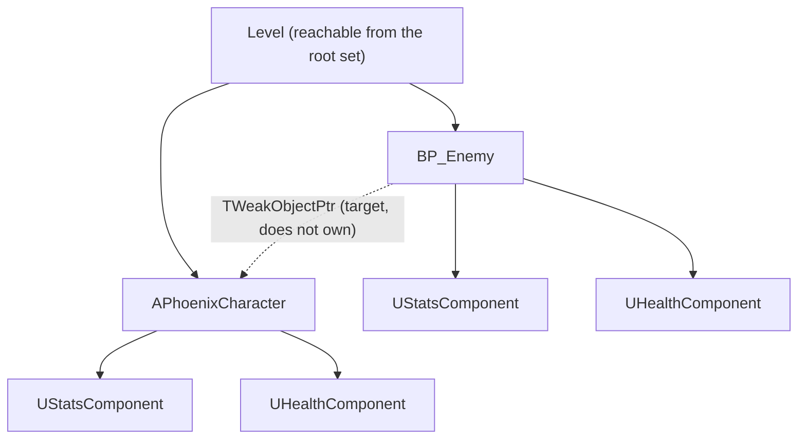
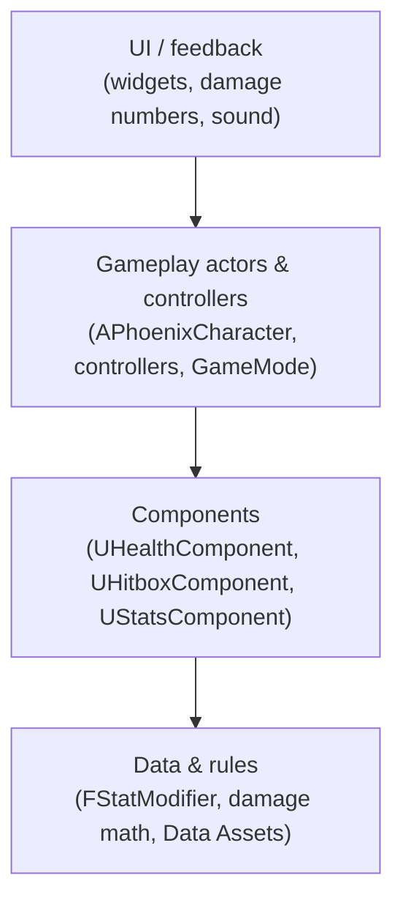

# OOP Foundations

> [!warning] **Superseded 2026-09-25 — written for Unreal Engine.** Phoenix moved to Rust + Bevy ([[Decisions]] ADR-008). Kept as history; the reasoning may still be useful, the mechanisms are not. Engine-independent design lives in [[Design-Doc]] and [[Combat]].


> [!info] **What this is.** The object-oriented ideas every Phoenix class is designed with, each shown in Unreal
> C++ terms and tied to Phoenix's own classes. It is the base layer under every technical spec in
> `01-architecture/` (the first is [[Combat-Tech]]). **Explanation form** in [[Documentation-Framework]] terms:
> understanding-oriented, not a tutorial.
>
> **Why it exists:** [[Decisions]] records the developer as "weak at OOP structuring", and names that as the main
> risk of choosing Unreal.

> [!note] **Code in this note is illustrative and has not been compiled.** It shows shape, not a final
> implementation. Engine facts are cited to UE 5.8.2 source as `file:line`.

## Revision history

| rev | date | what changed |
|---|---|---|
| r1 | 2026-09-15 | First draft. |
| **r2** | **2026-09-15** | After independent design and claim-verification reviews, every finding re-checked in engine source. Fixed: RPC quotes (were stitched from separate cells), PIE player counts (misread), game-instance wording, five citation lines, a leftover `ApplyDamage`, the "inherit once" attribution. **Added §7.5–§7.7**: cosmetics must not change simulation, RepNotify runs only on receivers, reliable RPCs are scarce. Two NOT-verified rows settled. |

## Evidence tiers

| tag | meaning |
|---|---|
| **[engine]** | Read in the installed UE 5.8.2 source, `/Users/Shared/Epic Games/UE_5.8/Engine/Source/` |
| **[epic-doc]** | Epic's documentation, wording checked against the page text on 2026-09-15 |
| **[paper]** | Primary paper, text checked |
| **[vault]** | Existing Phoenix note |
| **[design]** | A Phoenix design choice made in this note — **not a fact**, open to review |
| **[NOT verified]** | See §11 |

---

## 1. What an object is

An object is **some data plus the behaviour that keeps that data correct, behind one responsibility.** The
responsibility is the important part: it is the answer to *"what is this thing for?"* in one short sentence.

**[paper]** Kent Beck and Ward Cunningham, *A Laboratory For Teaching Object-Oriented Thinking*, OOPSLA '89:

> "The most difficult problem in teaching object-oriented programming is getting the learner to give up the
> global knowledge of control that is possible with procedural programs, and rely on the local knowledge of
> objects to accomplish their tasks."

They introduce **CRC cards**, which "characterize objects by class name, responsibilities, and collaborators",
and describe responsibilities this way:

> "The responsibilities of an object are expressed by a handful of short verb phrases, each containing an active
> verb."

**Phoenix uses CRC cards in every technical spec.** One card per class:

| Class | Responsibilities (short verb phrases) | Collaborators |
|---|---|---|
| `UHealthComponent` | Holds current and max health · applies incoming damage · announces death | `UStatsComponent` (reads max health) |

If a class needs more than a handful of verb phrases, or the phrases do not belong together, it is two classes.

## 2. The four ideas, in Unreal terms

### 2.1 Encapsulation — state is private, behaviour is the interface

Other objects ask an object to *do* something; they do not reach in and change its numbers.

```cpp
// illustrative
UCLASS()
class UHealthComponent : public UActorComponent
{
    GENERATED_BODY()
public:
    float TakeDamage(float Amount);           // the only way health goes down (name as in [[Architecture]])
    float GetHealth() const { return Health; }
private:
    UPROPERTY() float Health = 100.f;          // nobody outside sets this directly
};
```

**Why it matters in Phoenix:** if every system could write `Health` directly, there would be no single place to
enforce "can't go below zero", "only the server changes it" (§7), or "announce death once".

### 2.2 Inheritance — use it for *what role an object plays in the engine*

**[engine]** Unreal's gameplay classes form a hierarchy:

```
UObject
├── AActor                     Engine/Classes/GameFramework/Actor.h:282
│   ├── APawn                  Engine/Classes/GameFramework/Pawn.h:43
│   │   └── ACharacter         Engine/Classes/GameFramework/Character.h:338
│   ├── AController            Engine/Classes/GameFramework/Controller.h:40
│   │   ├── APlayerController  Engine/Classes/GameFramework/PlayerController.h:262
│   │   └── AAIController      AIModule/Classes/AIController.h:87
│   └── AInfo
│       ├── AGameModeBase      Engine/Classes/GameFramework/GameModeBase.h:47
│       ├── AGameStateBase     Engine/Classes/GameFramework/GameStateBase.h:32
│       └── APlayerState       Engine/Classes/GameFramework/PlayerState.h:41
├── UActorComponent            Engine/Classes/Components/ActorComponent.h:160
│   └── USceneComponent        Engine/Classes/Components/SceneComponent.h:88
└── UDataAsset
    └── UPrimaryDataAsset      Engine/Classes/Engine/DataAsset.h:47
```

> [!note] Readable copy on the [Phoenix Miro board](https://miro.com/app/board/uXjVHndMfFs=/?moveToWidget=3458764683755799081); **this note is canonical.**

**Rule [design]:** in C++, inherit from **one** engine class whose *role* you are filling. Blueprint subclasses of that class, for tuning and wiring, are fine. `APhoenixCharacter :
ACharacter` is correct — Phoenix's character *is* a character to the engine. `AFireSkeleton : ASkeleton : AEnemy
: ACharacter` is wrong — that is using inheritance to describe *content*, which is data (§6). [[Architecture]]
states the underlying preference (composition over deep subclass chains); the "one engine class in C++" form of it is new
here [design].

**The test:** can you finish the sentence *"A `Derived` **is a** `Base`, and anywhere the engine uses a `Base`, a
`Derived` works"*? If the honest answer is "sort of", use composition.

### 2.3 Composition — build behaviour by attaching parts

An actor is **assembled** from components, each with its own responsibility. [[Architecture]] shows the intended
shape [vault] (abridged — comments and the Behavior Tree line omitted):

```
BP_Enemy (subclass of APhoenixCharacter)
├── (inherited) CapsuleComponent, SkeletalMeshComponent, CharacterMovementComponent
├── UStatsComponent
├── UHealthComponent
├── UHitboxComponent
└── AI: APhoenixAIController possesses it
```

> [!note] Readable copy on the [Phoenix Miro board](https://miro.com/app/board/uXjVHndMfFs=/?moveToWidget=3458764683755799281); **this note is canonical.**

Player, every enemy and the boss share `UStatsComponent` and `UHealthComponent`. A "fast melee" and a "ranged"
enemy differ by **component settings and data**, not by class.

### 2.4 Polymorphism — one call, the right behaviour for each object

Two tools:

**Virtual functions** — a base class declares a function; subclasses may override it. **[engine]**
`Actor.h:3660`:

```cpp
ENGINE_API virtual float TakeDamage(float DamageAmount, struct FDamageEvent const& DamageEvent,
                                    class AController* EventInstigator, AActor* DamageCauser);
```

Anything that deals damage calls `TakeDamage` on *any* `AActor`, and doesn't need to know what it hit.

**Interfaces** — a promise of behaviour that unrelated classes can share without a common parent. **[engine]**
`CoreUObject/Public/UObject/Interface.h:18`: `class UInterface : public UObject`. Use one when classes that are
*not* related by inheritance must answer the same call — e.g. a breakable crate and an enemy both "can be
targeted". **Do not add an interface where the engine already has a virtual function** that does the job.

## 3. Responsibility design — the checks that catch bad classes

Apply these to every class in every technical spec:

| check | smell | fix |
|---|---|---|
| **One responsibility** | Its CRC card needs "and" to describe it | Split into two classes |
| **One reason to change** | A tuning change *and* a UI change both edit it | Split along the reasons |
| **Tell, don't ask** | Callers read its fields, decide, then write back | Move the decision into the object |
| **Knows little** | It holds pointers to many systems | Talk through events (§5) |
| **Content is data** | A new enemy/item/skill needs a new class | Make it a Data Asset (§6) |

### 3.1 Finding: UHitboxComponent has two responsibilities

**[vault]** [[Architecture]]: *"`UHitboxComponent` # deals/receives damage"*.

"Deals" and "receives" change for different reasons. Dealing is about attacks (timing, range, targets).
Receiving is already `UHealthComponent`'s job (*"current/max HP, TakeDamage(), OnDied delegate"*). Two components
both claiming damage means two places to fix every damage bug.

**Proposed [design]:** `UHitboxComponent` → **deals only** (finds what an attack hits). Receiving stays in
`UHealthComponent`. **Update r2:** narrowing it left a component with no data of its own, so [[Combat-Tech]] r2 defers
`UHitboxComponent` to the Skills spec and uses `UCombatComponent::CheckHit` instead. [[Architecture]] is unchanged for now.

## 4. Ownership and lifetime — who creates it, who keeps it alive, who destroys it

C++ normally makes you free memory yourself. Unreal objects (`UObject`) are **garbage collected**: the engine
frees an object once nothing it knows about refers to it.

**[epic-doc]** *Unreal Object Handling*:

> "you typically need to maintain a UPROPERTY reference to any Object you wish to keep alive, whether it's a simple
> Object pointer or an Unreal Engine container class that contains Object pointer types, such as TArray<UObject*>."

> "An Object reference stored in a raw pointer will be unknown to the Unreal Engine, and will not be automatically
> nulled, nor will it prevent garbage collection."

> "consider using TWeakObjectPtr. This is a "weak" pointer, meaning it will not prevent garbage collection, but it
> can be queried for validity before being accessed and will be set to null if the Object it points to is
> destroyed."

> "Actors and their Components are frequently an exception to this, since the Actors are usually referenced by an
> Object that links back to the root set, such as the Level to which they belong, and the Actor's Components are
> referenced by the Actor itself. Actors can be explicitly marked for destruction by calling their Destroy
> function".

**[engine]** `TObjectPtr` (`CoreUObject/Public/UObject/ObjectPtr.h:505-512`) is the UE5 replacement for raw pointer
members: *"When resolved, its participation in garbage collection is identical to a raw pointer to a UObject."* So
it is the `UPROPERTY()` on the member that makes the reference count, not the pointer type.

### 4.1 The four pointer choices

| you want | use | what happens when the target is destroyed |
|---|---|---|
| **Own / keep alive** | `UPROPERTY() TObjectPtr<UThing> Thing;` | Kept alive while referenced (**actors: only until `Destroy()`**) |
| **Refer to something you do not own**, which may die first | `TWeakObjectPtr<AActor> Target;` | Becomes null; check `IsValid()` before use |
| **Temporary, within one function** | raw `UThing*` local variable | Safe only for that call |
| **A raw `UThing*` member without `UPROPERTY`** | **never** | Not tracked, not nulled — a dangling pointer |

### 4.2 How each kind of object is created

| object | create with | [engine] |
|---|---|---|
| Component that is part of an actor's design | `CreateDefaultSubobject<T>(TEXT("Name"))` in the constructor | `CoreUObject/Public/UObject/Object.h:151` |
| Actor in the world | `GetWorld()->SpawnActor<T>()` | `Engine/Classes/Engine/World.h:3790` |
| Any other `UObject` at runtime | `NewObject<T>()` | `CoreUObject/Public/UObject/UObjectGlobals.h:1959` |
| **Never** | `new UThing` | — |

### 4.3 Ownership in Phoenix
**[design]**



> [!note] Readable copy on the [Phoenix Miro board](https://miro.com/app/board/uXjVHndMfFs=/?moveToWidget=3458764683756097311); **this note is canonical.**

Solid arrows own; the dotted arrow only *refers*. An enemy targeting the player must not keep a dead or
disconnected player alive, so it holds a weak pointer.

## 5. How objects talk — dependency direction

**The rule [design]:** dependencies point **downward only**. A lower layer never includes or calls a higher one.



> [!note] Readable copy on the [Phoenix Miro board](https://miro.com/app/board/uXjVHndMfFs=/?moveToWidget=3458764683756097313); **this note is canonical.**

When a lower layer needs to tell a higher one something ("I died"), it **broadcasts a delegate**; the higher
layer subscribes. **[engine]** `Core/Public/Delegates/DelegateCombinations.h:53` defines
`DECLARE_DYNAMIC_MULTICAST_DELEGATE_OneParam`.

| need | use |
|---|---|
| A owns B and asks it to act | Direct call (`Health->TakeDamage(10)`) |
| B must tell its owner, or unknown listeners, that something happened | Delegate on B (`OnDied`) |
| Unrelated systems react to a gameplay event | Event bus — **with the multiplayer caveat in §7.4** |

## 6. Data versus behaviour

**Content is data.** A new sword, enemy variant or skill is a new **Data Asset** or **Data Table row**, not a new
class. **[engine]** `UPrimaryDataAsset` (`Engine/Classes/Engine/DataAsset.h:47`); `UDataTable`
(`Engine/Classes/Engine/DataTable.h:76`).

| kind | holds | example |
|---|---|---|
| **Class** (C++) | Behaviour that is the same for every instance | `UHealthComponent` applies damage |
| **Data Asset** | One authored thing's settings | `DA_Enemy_FastMelee`: speed, health, attack range |
| **Data Table** | Many rows of one shape | Affix pool, drop weights |

## 7. Multiplayer-ready objects (decision: option B)

> [!important] **Decision context.** Stated in chat on 2026-09-15 as option B: Phoenix v1 is single-player, built so
> it can be played with multiple players. **Not yet an ADR in [[Decisions]]**, and [[Design-Doc]] §3 still lists
> multiplayer as out of scope. What "can be played with multiple players" includes in v1 is being confirmed —
> see [[Combat-Tech]] open questions. **The structure below is the same either way.**

### 7.1 Why this costs almost nothing in single-player

**[engine]** `Engine/Classes/Engine/EngineBaseTypes.h:978-993` (comments re-wrapped here for width):

```cpp
enum ENetMode : int
{
    /** Standalone: a game without networking, with one or more local players.
        Still considered a server because it has all server functionality. */
    NM_Standalone,
    /** Dedicated server: server with no local players. */
    NM_DedicatedServer,
    /** Listen server: a server that also has a local player who is hosting the game, available to other players on the network. */
    NM_ListenServer,
    /** Network client: client connected to a remote server.
        Note that every mode less than this value is a kind of server, so checking NetMode < NM_Client is always some variety of server. */
    NM_Client,
```

A single-player game **is a server**. Code written as "the server decides" runs unchanged when nobody else is
connected.

### 7.2 The five rules
**[design]**

1. **The server decides outcomes.** Health, damage, death, loot rolls, XP. Guard with `HasAuthority()`
   (**[engine]** `Actor.h:1938`, *"Returns whether this actor has network authority"*).
2. **Clients send intent, not results.** "I clicked here", not "I killed that enemy". Intent travels as a
   **Server RPC** on an actor the client owns.
3. **State reaches clients by replication.** Mark changing state `Replicated` / `ReplicatedUsing` (**[engine]**
   `ObjectMacros.h:1127-1131`), register it in `GetLifetimeReplicatedProps` (`Actor.h:306`) with `DOREPLIFETIME`
   (`Net/UnrealNetwork.h:259`), and enable `bReplicates` (`Actor.h:593`) or `SetIsReplicatedByDefault`
   (`ActorComponent.h:1471`).
4. **Cosmetics run locally.** Hit flash, damage numbers, sound: every machine plays its own, triggered from
   replicated state. They never decide anything.
5. **Test in three modes.** **[engine]** Play modes at `Editor/UnrealEd/Classes/Settings/LevelEditorPlaySettings.h:96-100`;
   how many instances each launches is decided in `Editor/UnrealEd/Private/PlayLevel.cpp:2891-2918`:

   | mode | setting | what actually launches |
   |---|---|---|
   | Standalone | Play Standalone | one game |
   | Listen server | Play As Listen Server, `PlayNumberOfClients = 3` | instance 0 is a host **with** a player; the rest are clients → host + 2 clients |
   | Client | Play As Client, `PlayNumberOfClients = 2` | an extra server instance **with no** player + 2 clients |

   **"Play As Listen Server" with 2 means host + 1 client, not 2 clients.** Mode *Client* is the one that exposes
   client-only bugs, because no machine is both server and player.

### 7.3 RPC types

**[epic-doc]** *Remote Procedure Calls in Unreal Engine*. Each cell quoted from its own table cell; the page's fourth
type, `Remote`, is omitted because Phoenix does not use it.

| specifier | Description (quoted) |
|---|---|
| `Client` | "The RPC is executed on the owning client connection for this actor." |
| `Server` | "The RPC is executed on the server. Must be called from the client that owns this actor." |
| `NetMulticast` | "The RPC is executed on the server and all currently connected clients the actor is relevant for." |

| specifier | Description (quoted) | Order of Execution (quoted) |
|---|---|---|
| `Reliable` | "This RPC is re-sent until it is acknowledged by the receiver. All subsequent RPC executions are suspended until this RPC is acknowledged." | "Guaranteed in order." |
| `Unreliable` | "This RPC is not executed if the packet is dropped." | "No order guarantee." |

From a callout below that table: *"RPCs are unreliable by default."*

The ownership rule is why player input RPCs go through the **player's own controller or pawn**, never through an
enemy or a world object.

### 7.4 Finding: the Architecture event bus does not cross machines
Concerns [[Architecture]].

**[vault]** [[Architecture]]:

> "`UGameInstanceSubsystem` — lives for the whole game session. Home for the **event bus** (a class that only
> declares delegates like `OnEnemyDied`, `OnItemPickedUp`) …"
> "the loot system listens for `OnEnemyDied` and never needs to know combat exists."

**[engine]** `Engine/Classes/Engine/GameInstance.h:144-147`:

```
GameInstance: high-level manager object for an instance of the running game.
Spawned at game creation and not destroyed until game instance is shut down.
Running as a standalone game, there will be one of these.
Running in PIE (play-in-editor) will generate one of these per PIE instance.
```

There is **one per game instance**: one in a standalone game, one per PIE instance — and several PIE instances can
share one process. With a server and two clients there are **three buses**.
`OnEnemyDied` broadcast on the server's bus is never heard on a client's bus.

In single-player this is invisible, since one program is both server and player. It breaks the moment option B is
exercised.

**Proposed rule [design]:** the event bus carries **server-side gameplay events only** (loot listens on the server,
where loot is decided). Anything a client must *show* arrives by **replicated state** on the actor concerned, and
the client reacts locally. This keeps [[Architecture]]'s decoupling and makes it correct in multiplayer.
**Changes an existing design — for review, not applied.**

### 7.5 Cosmetics must never change the simulation

"Local" is not the same as "cosmetic". On a listen host, or in Standalone, the local machine **is** the server.

**[engine]** `CustomTimeDilation` looks like a visual slow-down but scales real ticks:

- actor tick — `Engine/Private/Actor.cpp:379`: `Target->TickActor(DeltaTime*Target->CustomTimeDilation, …)`
- component ticks, movement included — `Engine/Classes/GameFramework/Actor.h:4890-4891`
- the server's movement timing for a remote client's character — `Engine/Private/Components/CharacterMovementComponent.cpp:9453`

World `TimeDilation` is `UPROPERTY(transient, replicated)` — `Engine/Classes/GameFramework/WorldSettings.h:741-742`.

**Rule [design]:** feedback changes only what is drawn or heard — materials, mesh animation rate
(`GlobalAnimRateScale`, `Engine/Classes/Components/SkeletalMeshComponent.h:677`), particles, sound, the local camera.
Anything that moves an actor or changes timing is gameplay and runs on the server. The worked case is
[[Combat-Tech#9.1 Why not CustomTimeDilation (r1's choice)|Combat-Tech §9.1]].

### 7.6 A RepNotify runs only on machines that receive the value

**[engine]** `FRepLayout::CallRepNotifies(FReceivingRepState*, …)` — `Engine/Private/RepLayout.cpp:4661`. The server
sets the value; it never receives it, so its `OnRep_` never runs there — and Standalone has no receiver at all.

**Rule [design]:** put the reaction in one idempotent function and call it from **both** the server path and the
`OnRep_` path. A one-parameter `OnRep_X(Type OldValue)` also receives the previous value (`RepLayout.cpp`, the
one-parameter notify case passes the shadow copy). Worked case: `HandleDeath` in
[[Combat-Tech#5.3 Death — one function, two callers|Combat-Tech §5.3]].

### 7.7 Reliable RPCs are scarce

Reliability is fixed per function by its `UFUNCTION` specifier. Reliable calls also block later ones until
acknowledged (§7.3), and their queue is bounded: `RELIABLE_BUFFER = 512` (`Engine/Classes/Engine/NetConnection.h:82`);
past it the channel logs *"Too many reliable messages queued up"* and closes with `MaxReliableExceeded`
(`Engine/Private/DataChannel.cpp:681-688`).

**Rule [design]:** Reliable only for rare, discrete requests — a click, a press, a release. Never per frame. Cosmetic
events are Unreliable; state that must arrive is a replicated property.

## 8. The class-design checklist

Every class in every technical spec answers these before it is accepted:

- [ ] **CRC card** — responsibilities as short active-verb phrases, and collaborators
- [ ] **Role** — which engine class it inherits from, and why that "is a" holds (§2.2)
- [ ] **Owner** — who creates it, with which function (§4.2), and who destroys it
- [ ] **References** — every pointer member is `UPROPERTY` (owning) or `TWeakObjectPtr` (non-owning) (§4.1)
- [ ] **Layer** — which layer it lives in; it depends only downward (§5)
- [ ] **Data** — nothing content-specific is hard-coded (§6)
- [ ] **Authority** — what runs on the server, what replicates, what is local-only (§7.2); replicated components call `SetIsReplicatedByDefault(true)`
- [ ] **Cosmetics** — nothing it does for looks changes simulation (§7.5); reactions to replicated state run on both paths (§7.6)
- [ ] **Events** — what it announces, and who is expected to listen

## 9. Glossary

| term | meaning | source, checked 2026-09-15 |
|---|---|---|
| CRC card | Class name, responsibilities, collaborators | Beck & Cunningham, OOPSLA '89 |
| `UObject` | Base of Unreal's garbage-collected object system | Epic *Unreal Object Handling* (§4) |
| `AActor` | "An Actor is an object that can be placed or spawned in the world." | `Actor.h:281` (ShortTooltip) |
| `UActorComponent` | A part attached to an actor | `ActorComponent.h:160` |
| `TObjectPtr` | UE5 object pointer member type; same GC behaviour as a raw pointer | `ObjectPtr.h:505-512` |
| `TWeakObjectPtr` | Pointer that does not keep its target alive and nulls on destruction | Epic *Unreal Object Handling*; `Core/Public/UObject/WeakObjectPtrTemplates.h:25` |
| `ENetMode` | Standalone, dedicated server, listen server, client | `EngineBaseTypes.h:978-993` |
| Authority | The machine allowed to change an actor's true state | `Actor.h:1938` |
| Replication | Server state copied to clients | `ObjectMacros.h:1127-1131`; `UnrealNetwork.h:259` |
| RPC | A function call sent across the network | Epic *Remote Procedure Calls* |
| `AGameModeBase` | Game rules; "only instanced on the server and will never exist on the client" | `GameModeBase.h:35` |
| `UGameInstance` | One per game instance — one standalone, one per PIE instance | `GameInstance.h:144-147` |
| RepNotify | Function called when a replicated property arrives — receivers only | `RepLayout.cpp:4661` |

## 10. What this note deliberately does not cover

- **Unreal project anatomy** (`.uproject`, modules, UnrealHeaderTool) — research item R2.
- **Client-side prediction / lag compensation** — not needed for v1's single-player default; revisit if
  multiplayer is exercised seriously.
- **Gameplay Ability System** — [[Architecture]] records it as the later upgrade path, not v1.

## 11. NOT verified

| claim | why | what would settle it |
|---|---|---|
| ~~Which network roles hold a controller~~ | **Settled r2:** controllers are `bOnlyRelevantToOwner = true` (`Engine/Private/Controller.cpp:67`) — a player controller exists on the server and its owning client; an AI controller, with no owning client, only on the server | — |
| Where HUD widgets exist (local only) | Standard behaviour, not source-checked | Epic's *Networking Overview*, text checked |
| The event-bus finding's fix is sufficient for loot in multiplayer | Loot-per-player is not designed yet | The Loot technical spec |
| Interfaces versus `TakeDamage` for targeting | A design preference, not measured | Decided per feature in its technical spec |

## Sources

- Kent Beck, Ward Cunningham — [A Laboratory For Teaching Object-Oriented Thinking](https://c2.com/doc/oopsla89/paper.html), OOPSLA '89
- Epic — [Unreal Object Handling in Unreal Engine](https://dev.epicgames.com/documentation/en-us/unreal-engine/unreal-object-handling-in-unreal-engine)
- Epic — [Remote Procedure Calls in Unreal Engine](https://dev.epicgames.com/documentation/en-us/unreal-engine/remote-procedure-calls-in-unreal-engine)
- Unreal Engine 5.8.2 source, installed at `/Users/Shared/Epic Games/UE_5.8/Engine/Source/`

## Related

- [[Architecture]] · [[Combat-Tech]] · [[Coding-Conventions]] · [[Decisions]]
