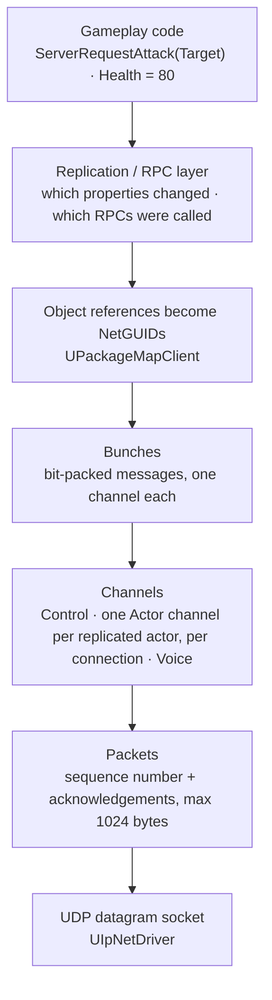

# Unreal Networking — Research

> [!info] **Scope.** How a gameplay call such as `ServerRequestAttack(Target)` becomes bytes on the wire in Unreal
> Engine 5.8, and what controls how much is sent. **Facts only — no design.** The design that uses these facts is
> [[Network-Protocol]].

## Revision history

| rev | date | what changed |
|---|---|---|
| r1 | 2026-09-15 | First draft. Every engine claim read in the installed source; six line numbers corrected after reading each citation back. |
| **r2** | **2026-09-15** | After an independent claim-verification review (98 claims, 8 false, 7 unsupported, 0 wrong citations); every finding re-checked in source. **Corrected:** quantized-vector cost (header comments are stale), reliable ordering and the two separate 512 limits, "costs nothing when unchanged", bunch header vs in-memory members, the 5.5 deprecation wording. **Added:** §8.4 unreliable multicasts are queued and capped at 2 per update; §8.5 failed RPC validation disconnects; NAK resend of properties; unmapped object parameters arrive as null; Blueprint RepNotify exception. |

## Evidence tiers

| tag | meaning |
|---|---|
| **[engine]** | Read in `/Users/Shared/Epic Games/UE_5.8/Engine/`, cited as `file:line`. Paths under `Source/Runtime/` unless shown |
| **[config]** | Read in `Engine/Config/BaseEngine.ini` |
| **[epic-doc]** | Epic documentation, wording checked against the page text |
| **[NOT verified]** | See §13 |

---

## 1. The whole stack in one picture



You write only the top box. Everything below it is the engine. A readable copy is on the [Phoenix Miro board](https://miro.com/app/board/uXjVHndMfFs=/?moveToWidget=3458764683744620156); this note is canonical.

## 2. Transport — UDP

**[engine]** The default IP net driver creates a datagram socket:
`Plugins/Online/OnlineSubsystemUtils/Source/OnlineSubsystemUtils/Private/IpNetDriver.cpp:777` —
`SocketSubsystem->CreateUniqueSocket(NAME_DGram, …)`. The class is `UIpNetDriver : public UNetDriver`
(`…/OnlineSubsystemUtils/Classes/IpNetDriver.h:65`).

**[engine]** Maximum packet size: `Source/Runtime/CoreUObject/Public/UObject/CoreNet.h:794` —

```cpp
enum { MAX_PACKET_SIZE = 1024 }; // MTU for the connection
```

and each IP connection uses it unless overridden, with the UDP header counted as overhead:
`…/OnlineSubsystemUtils/Private/IpConnection.cpp:121-122` —
`(InMaxPacket == 0 || InMaxPacket > MAX_PACKET_SIZE) ? MAX_PACKET_SIZE : InMaxPacket, InPacketOverhead == 0 ? UDP_HEADER_SIZE : InPacketOverhead`.

**So:** UDP gives no delivery or ordering guarantee. Everything reliable in Unreal is built on top, by the engine,
inside packets of at most 1024 bytes.

## 3. Packets — sequence numbers and acknowledgements

**[engine]** `Engine/Public/Net/NetPacketNotify.h:36-45`:

```cpp
/** FNetPacketNotify - Drives delivery of sequence numbers, acknowledgments and notifications of delivery sequence numbers */
class FNetPacketNotify
{
    enum { SequenceNumberBits = 14 };
    enum { MaxSequenceHistoryLength = 256 };
```

- Every packet has a **14-bit sequence number**.
- The receiver keeps a **history of up to 256** recent sequence numbers.
- When writing a packet header, `FNetPacketNotify::WriteHeader` (`Engine/Private/Net/NetPacketNotify.cpp:203`) records
  *"the last InSeq we have acknowledged at this time"* (`:224-225`) and writes the history words.

**So:** acknowledgement of received packets travels **in the headers of packets going the other way**, as the last
sequence number plus a bit history — the sender learns which of its packets arrived, and which did not.

## 4. Bunches — the messages inside packets

**[engine]** `Engine/Public/Net/DataBunch.h:23` — `class FOutBunch : public FNetBitWriter` (and `FInBunch : public
FNetBitReader` at `:126`). A bunch is a **bit-level** writer, not a byte buffer.

**`FOutBunch` members** (`:30-45`) — in-memory bookkeeping, not all of it is sent:

| member | meaning |
|---|---|
| `ChIndex`, `ChName` | Which channel this bunch belongs to |
| `ChSequence` | Order within the channel (for reliable delivery) |
| `PacketId` | Which packet carried it — used to match acks; **not written to the wire** |
| `bOpen`, `bClose` | This bunch opens or closes the channel |
| `bReliable` | Must be delivered |
| `bPartial`, `bPartialInitial`, `bPartialFinal` | *"Not a complete bunch"* — one large message split across packets |
| `bHasPackageMapExports` | *"This bunch has networkGUID name/id pairs"* (§7) |

**What is actually written** — `UNetConnection::SendRawBunch`, `Engine/Private/NetConnection.cpp:4518` onward: an
open-or-close bit (then open and close bits), a replication-paused bit, the reliable bit, `ChIndex` packed, the
package-map-exports and must-be-mapped bits, the partial bit, and **`ChSequence` only when the bunch is reliable**
(`if (Bunch.bReliable && !IsInternalAck())`, `:4558-4560`); the channel name is written only when the bunch is open or
reliable (`bIsOpenOrReliable`, `:4533`).

**So:** a reliable bunch carries more header than an unreliable one.

## 5. Channels

| channel | engine description | [engine] |
|---|---|---|
| `UControlChannel` | *"A channel for exchanging connection control messages."* | `Engine/Classes/Engine/ControlChannel.h:40-43` |
| `UActorChannel` | *"A channel for exchanging actor and its subobject's properties and RPCs."* | `Engine/Classes/Engine/ActorChannel.h:47` |
| `UVoiceChannel` | Voice data | `Engine/Classes/Engine/VoiceChannel.h:19` |

**One actor channel per replicated actor, per connection:** `UActorChannel` holds a single `Actor` — *"Actor this
corresponds to."* (`ActorChannel.h:86`) — and each connection has its own channels. The actor's components ride on
the same channel.

**[engine]** What an actor-channel bunch contains, drawn by Epic in `ActorChannel.h:52-74` (abridged — blank rows removed):

```
+----------------------+---------------------------------------------------------------------------+
| SpawnInfo            | (Spawn Info) Initial bunch only                                           |
|  -Actor Class        |   -Created by ActorChannel                                                |
|  -Spawn Loc/Rot      |                                                                           |
| NetGUID assigns      |                                                                           |
|  -Actor NetGUID      |                                                                           |
|  -Component NetGUIDs |                                                                           |
+----------------------+---------------------------------------------------------------------------+
| NetGUID ObjRef       | (Content chunks) x number of replicating objects (Actor + any components) |
|                      |   -Each chunk created by its own FObjectReplicator instance.              |
+----------------------+---------------------------------------------------------------------------+
| Properties...        |                                                                           |
| RPCs...              |                                                                           |
+----------------------+---------------------------------------------------------------------------+
| </End Tag>           |                                                                           |
+----------------------+---------------------------------------------------------------------------+
```

> [!note] Readable copy on the [Phoenix Miro board](https://miro.com/app/board/uXjVHndMfFs=/?moveToWidget=3458764683756040984); **this note is canonical.**

**So:** a combat RPC on `UHealthComponent` travels on its **character's** actor channel, as a content chunk for that
component.

## 6. Reliable versus unreliable — how resending works

### 6.1 Sending

**[engine]** A reliable bunch is given the channel's next `ChSequence` and **sent immediately**; the sender keeps it
until it is acknowledged (`Engine/Private/DataChannel.cpp:1534-1552`). Nothing waits for an earlier ack before sending.

When a packet is reported lost, `UChannel::ReceivedNak` (`DataChannel.cpp:1648`) resends the reliable bunches it
carried:

```cpp
if( Out->PacketId==NakPacketId && !Out->ReceivedAck )
{
    check(Out->bReliable);
    UE_LOGF(LogNetTraffic, Log, "      Channel %i nak); resending %i...", Out->ChIndex, Out->ChSequence );
```

Unreliable bunches are not kept, so a lost packet loses them. **[epic-doc]** *"This RPC is not executed if the packet
is dropped."*

### 6.2 Receiving — reliable bunches run in order, unreliable do not wait

**[engine]** `DataChannel.cpp:640-648`: a reliable bunch that arrives **ahead of** a missing earlier one is buffered:

```cpp
if ( Bunch.bReliable && Bunch.ChSequence != Connection->InReliable[ChIndex] + 1 )
{
    ...
    // If this bunch has a dependency on a previous unreceived bunch, buffer it.
```

Anything else — an in-order reliable bunch, or **any unreliable bunch** — is processed at once (the `else` branch,
`:694-696`).

**So:** a lost reliable bunch **holds back later reliable bunches on the same channel** until it is resent; unreliable
bunches on that channel are not held, and can run before an earlier reliable one. Epic's documentation states the
same effect as *"All subsequent RPC executions are suspended until this RPC is acknowledged."* **[epic-doc]**

### 6.3 Two separate limits of 512

**[engine]** `Engine/Classes/Engine/NetConnection.h:82` — `enum { RELIABLE_BUFFER = 512 };`, used twice:

| limit | what it counts | on overflow | [engine] |
|---|---|---|---|
| **Outgoing** | Reliable bunches sent but not yet acknowledged, per channel | *"Outgoing reliable buffer overflow"*; connection closed with `ENetCloseResult::ReliableBufferOverflow` | `DataChannel.cpp:1414`, `:1439-1445` |
| **Incoming** | Reliable bunches buffered because they arrived out of order, per channel | *"Too many reliable messages queued up"*; bunch error `ENetCloseResult::MaxReliableExceeded` | `DataChannel.cpp:681-688` |

**So:** both limits fill only when many reliable bunches pile up **behind loss or missing acknowledgements** — a
high send rate alone does not reach them, but a high rate on a lossy connection can.

## 7. Object references — NetGUIDs

A pointer such as `AActor* Target` cannot be sent as a memory address. **[engine]** `UPackageMapClient : public
UPackageMap` (`Engine/Classes/Engine/PackageMapClient.h:464`) maps objects to **network GUIDs**; the actor channel
assigns them in the first bunch (§5 diagram, "NetGUID assigns"), and a bunch carrying new pairs sets
`bHasPackageMapExports` (§4).

**So:** `ServerRequestAttack(Target)` sends a small id for `Target`, not the actor.

**An id that doesn't resolve arrives as null.** **[engine]** `Engine/Private/DataReplication.cpp:44-49`:

```cpp
TEXT("net.DelayUnmappedRPCs"), 0,
TEXT("If true delay received RPCs with unmapped object references until they are received or loaded, ")
TEXT("if false RPCs will execute immediately with null parameters. ")
```

The default is 0: **an RPC runs immediately, with a null parameter.**

## 8. Property replication — two systems, one is the default

**[engine]** Unreal 5.8 ships two replication systems. `Source/Runtime/Net/Iris/Private/Iris/IrisConfig.cpp:15-16`:

```cpp
static int32 GUseIrisReplication = 0;
... TEXT("net.Iris.UseIrisReplication") ... TEXT("Enables Iris replication system. 0 will fallback to legacy replicationsystem.")
```

**[config]** `BaseEngine.ini:346` (section `[/Script/Engine.Engine]`):
`+IrisNetDriverConfigs=(NetDriverDefinition=GameNetDriver, bCanUseIris=true)` — Iris is **allowed** for the game net
driver, not **enabled**. No base config sets `net.Iris.UseIrisReplication`.

**So: Phoenix uses the legacy replication system unless it opts in to Iris.** Everything below describes the legacy
path.

### 8.1 The legacy server path

| step | [engine] |
|---|---|
| Each net tick, the server decides which actors to replicate to each connection | `UNetDriver::ServerReplicateActors` — `Engine/Private/NetDriver.cpp:6277` |
| For each object, its replicator writes what changed | `FObjectReplicator::ReplicateProperties` — `Engine/Private/DataReplication.cpp:1913` |
| "What changed" = current values compared against the last-sent **shadow** copy | `FRepLayout::CompareProperties` — `Engine/Private/RepLayout.cpp:1777` |

**When a property is sent:** when it changes (above); in full when the actor's channel **opens** for a client — the
"Initial bunch" of the §5 diagram, including when an actor becomes relevant again; and **again after loss**:
`FObjectReplicator::ReceivedNak` (`DataReplication.cpp:888-925`) finds the change-history entries sent in the lost
packet and sets `HistoryItem.Resend = true`.

**So:** apart from those cases, an unchanged property costs only the comparison. And because a resend sends the
**current** value, **only the latest value is guaranteed** — an intermediate value that changed again before it was
delivered may never be seen by the client.

### 8.2 The client path

Received properties are applied, then RepNotifies run — **only on receivers** (for C++ properties; a RepNotify variable
defined in a **Blueprint** also runs its notify locally when set — `Editor/BlueprintGraph/Private/K2Node_VariableSet.cpp:66`,
`PropertyHasLocalRepNotify`): `FRepLayout::CallRepNotifies(FReceivingRepState*, …)`
(`RepLayout.cpp:4661`). A one-parameter RepNotify receives the previous value (the shadow copy). Worked consequence:
[[OOP-Foundations#7.6 A RepNotify runs only on machines that receive the value|OOP-Foundations §7.6]].

### 8.3 The RPC path

**[engine]** `UNetDriver::ProcessRemoteFunctionForChannel` — `NetDriver.cpp:3189` — writes an RPC's parameters into
a bunch on the target actor's channel. Which machine may call which kind of RPC: **[epic-doc]** quoted in
[[OOP-Foundations#7.3 RPC types|OOP-Foundations §7.3]].

### 8.4 Unreliable multicasts are queued and capped per update

**[engine]** `Engine/Private/NetDriver.cpp:3400` — `QueueBunch = ( !Bunch.bReliable && Function->FunctionFlags & FUNC_NetMulticast );`
and `:3453` — *"Unreliable multicast functions are queued and sent out during property replication"*.

**[engine]** `Engine/Private/DataReplication.cpp:38-42`:

```cpp
TEXT("net.MaxRPCPerNetUpdate"), 2,
TEXT("Maximum number of unreliable multicast RPC calls allowed per net update, additional ones will be dropped"),
```

The check is per function, per replicated object (`:2324-2331`), logging *"Too many calls (%d) to RPC %ls within a
single netupdate. Skipping."* at `Verbose`. Epic's comment (`:2301-2302`): *"just don't let same func be called more
than twice in one network update period."* The count is cleared after each update (`RemoteFuncInfo.Empty()`, `:2108`).

**So:** an unreliable multicast is **delayed until the object's next replication update**, and a third call of the same
function on the same object in one update is **dropped by the sender** — not only lost to packet loss.

### 8.5 A failed RPC validation disconnects the client

**[epic-doc]** *Remote Procedure Calls*: *"If the inputs pass validation, the implementation is called. If the inputs
fail validation, the invoking client is disconnected from the server."* **[engine]** A failed received RPC returns false
from the receive path (`DataReplication.cpp:1465-1468`).

**So:** `WithValidation` is for input no honest client can produce. An ordinary gameplay rejection (target out of range,
target dead) must not use it.

## 9. What controls how much is sent

### 9.1 Per actor

**[engine]** `Engine/Classes/GameFramework/Actor.h`, each with Epic's own description:

| property | description (quoted) | line |
|---|---|---|
| `NetUpdateFrequency` | "How often (per second) this actor will be considered for replication, used to determine NetUpdateTime" | `:902-905` |
| `MinNetUpdateFrequency` | "Used to determine what rate to throttle down to when replicated properties are changing infrequently" | `:907-910` |
| `NetCullDistanceSquared` | "Square of the max distance from the client's viewpoint that this actor is relevant and will be replicated." | `:897-900` |
| `bOnlyRelevantToOwner` | "If true, this actor is only relevant to its owner. …" | `:327-329` |
| `bAlwaysRelevant` | "Always relevant for network (overrides bOnlyRelevantToOwner)." | `:331-333` |
| `NetDormancy` | "Dormancy setting for actor to take itself off of the replication list without being destroyed on clients." | `:867-869` |
| `NetPriority` | "Priority for this actor when checking for replication in a low bandwidth or saturated situation, higher priority means it is more likely to replicate" | `:912-914` |

Default update frequency: `SetNetUpdateFrequency(100.0f);` in `Engine/Private/Actor.cpp:295`, and `SetNetUpdateFrequency(100.f);`
in `Engine/Private/Pawn.cpp:88` — an **upper bound**; the server's own network tick may cap it (§13). In 5.5, public
access to `NetUpdateFrequency`, `MinNetUpdateFrequency` and `NetCullDistanceSquared` was deprecated in favour of getters
and setters — e.g. `UE_DEPRECATED(5.5, "Public access to NetUpdateFrequency has been deprecated. …")` (`Actor.h:903`).
The members stay under `public:` (`Actor.h:866`); `NetPriority`, `NetDormancy`, `bOnlyRelevantToOwner` and
`bAlwaysRelevant` are not deprecated.

### 9.2 Global defaults

**[config]** `Engine/Config/BaseEngine.ini`:

| setting | value | section | line |
|---|---|---|---|
| `NetServerMaxTickRate` | 30 | `[/Script/OnlineSubsystemUtils.IpNetDriver]` | 1867 |
| `MaxNetTickRate` | 120 | same | 1868 |
| `MaxClientRate` | 100000 | same | 1860 |
| `MaxInternetClientRate` | 100000 | same | 1861 |
| `ConfiguredInternetSpeed` | 100000 | `[/Script/Engine.Player]` | 1839 |
| `ConfiguredLanSpeed` | 100000 | same | 1840 |

Units and exact effects: **[NOT verified]** — see §13.

### 9.3 Sending fewer bits — quantized vectors

**[engine]** `Engine/Classes/Engine/NetSerialization.h` — **as Epic's header comments describe them**:

| type | precision | bits per component (comment) | range (comment) | line |
|---|---|---|---|---|
| `FVector_NetQuantize` | 0 decimal places | up to 20 | ±1,048,576 | `:399-409` |
| `FVector_NetQuantize10` | 1 decimal place | up to 24 | ±1,677,721.6 | `:448-454` |
| `FVector_NetQuantize100` | 2 decimal places | up to 30 | ±10,737,418.24 | `:493-499` |
| `FVector_NetQuantizeNormal` | — | — | — | `:540` |

**Those comments are stale in 5.8.** `WritePackedVector` ignores its maximum-bits parameter
(`NetSerialization.h:207-211`):

```cpp
template<int32 ScaleFactor, int32 MaxBitsPerComponent>
bool WritePackedVector(FVector3f Value, FArchive& Ar)
{
    return UE::Net::WriteQuantizedVector(ScaleFactor, Value, Ar);
}
```

**[engine]** The real encoding — `Source/Runtime/Net/Core/Private/Net/Core/Serialization/QuantizedVectorSerialization.cpp:90-104`:
a **7-bit header** (`Ar.SerializeInt(ComponentBitCountAndScaleInfo, 1U << 7U)`), then each of X, Y, Z in **as many bits
as the largest scaled component needs**; a value that cannot be quantized falls back to **full precision** —
`Ar.SerializeBits(… , ScalarTypeSize*8U*3U)`.

**So:** a quantized position costs a 7-bit header plus three components sized to the value — cost grows with distance
from the origin, and there is **no hard range limit**, only a fallback to full-size values. The exact bit count for a
given position is **[NOT verified]** (§13).

## 10. Testing under bad network conditions

**[engine]** `struct FPacketSimulationSettings` — `Engine/Classes/Engine/NetDriver.h:458`:

| setting | description (quoted) | line |
|---|---|---|
| `PktLoss` | "Value is treated as % of packets dropped (i.e. 0 = None, 100 = All)." | `:462-471` |
| `PktLag` | "Value is treated as millisecond lag." | `:512-519` |
| `PktLagVariance` | "Value is treated as millisecond lag range (e.g. -GivenVariance <= 0 <= GivenVariance)." | `:521-528` |
| `PktDup` | Duplicates packets | `:510` |

**[engine]** The editor exposes network emulation for Play In Editor: `FLevelEditorPlayNetworkEmulationSettings
NetworkEmulationSettings` (`Editor/UnrealEd/Classes/Settings/LevelEditorPlaySettings.h:506`), enabled flag read at `:499`.

## 11. What this means for a protocol design

Facts to carry into [[Network-Protocol]], not decisions:

1. **Each command costs bits, not a fixed-size packet.** Parameters are bit-packed; object pointers become NetGUIDs;
   vectors can be quantized.
2. **Reliable bunches are ordered per channel.** A lost one holds back later reliable bunches on that channel until it
   is resent. Two separate limits of 512 per channel exist, reached when reliable bunches pile up behind loss (§6).
3. **Unreliable bunches can be lost** — and **unreliable multicasts can also be dropped by the sender**: more than 2 calls
   of one function on one object per update (§8.4).
4. **Replicated properties are sent on change, on channel open, and again after loss — and only the latest value is
   guaranteed** (§8.1).
5. **Object parameters can arrive null** (§7).
6. **`WithValidation` failure disconnects the client** (§8.5).
7. **How often an actor is considered** is its `NetUpdateFrequency`, default 100 per second for `AActor` and `APawn` — an
   upper bound (§9.1).
8. **Bad networks can be simulated** in the editor (§10).

## 12. Glossary

| term | meaning | source, checked 2026-09-15 |
|---|---|---|
| Net driver | Owns the socket and all connections | `NetDriver.h:810`; `IpNetDriver.h:65` |
| Connection | One remote machine | `NetConnection.h` |
| Packet | One UDP datagram, ≤ 1024 bytes by default | `CoreNet.h:794` |
| Bunch | A bit-packed message on one channel | `DataBunch.h:23` |
| Channel | A stream of bunches: control, one per actor, voice | `Channel.h:62`, §5 |
| NetGUID | Network id standing in for an object pointer | `PackageMapClient.h:464` |
| Shadow state | Last-sent copy of properties, compared each tick | `RepLayout.cpp:1777` |
| Relevancy | Whether an actor is replicated to a given client | `Actor.h:327-333, 897-900` |
| Dormancy | Actor removed from replication without being destroyed | `Actor.h:867-869` |
| Iris | Newer replication system; off by default in 5.8 | `IrisConfig.cpp:15-16` |

## 13. NOT verified

| claim | why | what would settle it |
|---|---|---|
| Units of `MaxClientRate` / `ConfiguredInternetSpeed` (bytes per second?) | Values read, meaning not traced | Read where `UNetConnection` applies them |
| `NetServerMaxTickRate = 30` means the server sends network updates at most 30 times per second | Inferred from the name | Trace its use in `UIpNetDriver` / `UNetDriver::TickDispatch` |
| How relevancy, priority and dormancy are applied inside `ServerReplicateActors` | The function delegates to helpers not read | Read `ServerReplicateActors_*` helpers in `NetDriver.cpp` |
| Whether a packet with no data is sent just to carry acknowledgements | Not traced | `UNetConnection::Tick` / `FlushNet` |
| How large bunches are split into partial bunches | Flags read, splitting not traced | `UChannel::SendBunch` |
| Handshake, encryption, packet handlers | Out of scope for this pass | `PacketHandler`, `StatelessConnectHandlerComponent` |
| How Iris differs for Phoenix's design | Iris not studied | A separate research pass, only if Iris is chosen |
| The exact bits a quantized vector costs for a given position | Encoding read, not measured | Serialize a known `FVector_NetQuantize` into an `FNetBitWriter` and read `GetNumBits()` |
| `FVector_NetQuantizeNormal` implementation | Only its comment read | Read its `NetSerialize` |
| What the RPC flood detection (`[GameNetDriver RPCDoSDetection]`, `BaseEngine.ini:1924`, off by default) does at each tier, including kicking | Only its configuration read | Read `Engine/Private/Net/RPCDoSDetection.cpp` before enabling it |
| Whether `NetServerMaxTickRate` caps how often the §8.4 multicast cap resets | Depends on the unverified tick-rate row above | Same trace as that row |

## Sources

- Unreal Engine 5.8.2 source, installed at `/Users/Shared/Epic Games/UE_5.8/Engine/`
- Epic — [Remote Procedure Calls in Unreal Engine](https://dev.epicgames.com/documentation/en-us/unreal-engine/remote-procedure-calls-in-unreal-engine) (quotes checked 2026-09-15, see [[OOP-Foundations]] r2)

## Related

- [[Network-Protocol]] · [[OOP-Foundations]] · [[Combat-Tech]] · [[00-Research-Hub]]
